<div align="center">

# Sticky notes

### Your notes, always in sight.

Sticky notes that float **above** your other windows — so your todo list is still
there when the browser isn't.

[](LICENSE)
[](#-your-notes-never-leave-your-browser)
[](#-your-notes-never-leave-your-browser)
[](#-your-notes-never-leave-your-browser)



</div>

---

## The problem

Paper todos work because they're **always visible**. You don't open them. You
just look up, and there they are.

Every todo app breaks that. Your tasks live behind a window you have to
remember to open — and the moment you're deep in something else, they may as
well not exist.

<table>
<tr>
<td width="50%" valign="top">

**A paper note on your desk**

Always visible · zero friction · glance and go · never in the way

</td>
<td width="50%" valign="top">

**A note in a todo app**

Hidden behind a window · open it, find it, remember it existed

</td>
</tr>
</table>

This is the first one, on your screen.

## How it works

```
   Write a note                    Click Float
        │                              │
        ▼                              ▼
┌─────────────────┐          ┌───────────────────┐
│ TODAY           │          │  a real, small,   │
│ [ ] Fix pixel   │  ──────► │  always-on-top    │
│ [ ] Reply to JK │          │  window           │
│ [x] Deploy MCP  │          └───────────────────┘
└─────────────────┘                    │
                                       ▼
                          Minimise the browser. Open your editor.
                          Go fullscreen. Join a call.

                          The note is still there.
```

It's a real OS-level window, courtesy of the
[Document Picture-in-Picture API](https://developer.mozilla.org/en-US/docs/Web/API/Document_Picture-in-Picture_API) —
not a floating `<div>` that vanishes the moment you leave the tab.

## The workspace



No projects. No tags. No priorities. No due dates. No dashboards. Just paper.

---

## 🔒 Your notes never leave your browser

Not a policy. **A property of the build.**

| | |
|---|---|
| **Stored where?** | IndexedDB, on your device, in your browser |
| **Sent where?** | Nowhere. Zero bytes, ever |
| **Server** | There isn't one. There's no backend to send anything to |
| **Account** | None. Nothing to sign up for |
| **Analytics / telemetry / cookies** | None |
| **Third-party scripts, fonts, CDNs** | None. Everything ships from your own origin |
| **Offline** | Works completely |

The production build ships a Content Security Policy containing
**`connect-src 'none'`**. That means the browser itself refuses every `fetch`,
`XMLHttpRequest`, WebSocket, `EventSource`, and `sendBeacon` this page could
ever attempt. Combined with `default-src 'none'` and `form-action 'none'`,
there is no route out — not through a bug, not through a dependency, not
through a future careless commit.

<details>
<summary><b>Don't take my word for it — three ways to check</b></summary>

<br>

**1. Read the policy.** It's declared in plain sight in
[`vite.config.ts`](vite.config.ts) and injected into the built `index.html`.

**2. Watch the network.** Open DevTools → Network, use the app for as long as
you like, tick things off, float a note. The request list stays empty.

**3. Pull the plug.** Turn off your Wi-Fi and keep working. Nothing degrades,
because nothing was ever going anywhere.

**4. Read the source.** There is no `fetch` in it:

```bash
grep -rn "fetch\|XMLHttpRequest\|WebSocket\|sendBeacon" src/
# (no output)
```

</details>

<details>
<summary><b>What this means for you, practically</b></summary>

<br>

- Notes are **private to one browser on one device**. They don't sync — that's
  the trade for having no server.
- Clearing your browser's site data deletes them, the same as throwing away
  paper.
- Nobody — including me — can read them. There is no place they could be read
  from.

</details>

---

## Writing on paper

A note is plain text. Start a line with `[ ]` and it becomes a real checkbox
you can tick — including inside the floating window.

```
TODAY

[ ] Fix pixel issue
[x] Deploy MCP

→ ask design about tracking

IMPORTANT
Don't forget this one.
```

Nothing is forced into being a task. Notes hold lists, reminders, half-thoughts,
arrows, and headings, because that's what paper holds.

<details>
<summary><b>Keyboard</b></summary>

<br>

| Key | Does |
|---|---|
| <kbd>N</kbd> | New note, cursor already in it |
| <kbd>F</kbd> | Float the note you last touched |
| <kbd>Enter</kbd> (title) | Jump into the note |
| <kbd>Enter</kbd> (task line) | New task line |
| <kbd>Enter</kbd> (empty task) | End the list, back to plain text |
| <kbd>⌘</kbd>/<kbd>Ctrl</kbd> + <kbd>Enter</kbd> | Tick the current line, or turn it into a task |
| <kbd>Backspace</kbd> (line start) | Un-task the line; press again to merge it up |
| <kbd>↑</kbd> <kbd>↓</kbd> | Move between lines |
| <kbd>Esc</kbd> | Stop editing |

Bare keys, no modifiers — they're inactive while you're typing, so they never
collide with anything. Deliberately **not** <kbd>⌘</kbd>+<kbd>N</kbd>: Chrome
reserves that for a new window and a web page cannot intercept it.

</details>

---

## Browser support

Floating needs the Document Picture-in-Picture API.

| Browser | Notes & checkboxes | Floating window |
|---|:---:|:---:|
| Chrome 116+ | ✅ | ✅ |
| Edge 116+ | ✅ | ✅ |
| Firefox 151+ | ✅ | ✅ |
| Safari | ✅ | ❌ not yet |

Where floating isn't available the app says so plainly and everything else keeps
working. It never fails silently.

## Run it

```bash
npm install
npm run dev
```

Then press <kbd>N</kbd>, type, and click **Float**.

<details>
<summary><b>Other commands</b></summary>

<br>

```bash
npm run build     # type-check and build to dist/ (with the CSP baked in)
npm run preview   # serve the production build at localhost:4173
npm run lint
```

Deploy `dist/` to any static host. If your host lets you set headers, send the
same Content Security Policy as a real header too — a `<meta>` tag is good, a
header is better.

</details>

## How it's built

React · TypeScript · Vite · IndexedDB. No UI framework, no CSS framework, no
state library beyond a 1 kB store.

```
        StickyNote (desk)          FloatingNote (PiP window)
              │                              │
              └──────────────┬───────────────┘
                             │     PaperEditor · ColorDots
                       notesStore   ← plain JS, no React
                             │
                       NoteRepository   ← the only storage contract
                             │
                         IndexedDB
```

<details>
<summary><b>Why there's no message passing between the two windows</b></summary>

<br>

The Picture-in-Picture window is same-origin and shares one JavaScript realm
with the page that opened it. So both windows hold **the same store object by
direct reference** — no `BroadcastChannel`, no serialization, no sync protocol,
and exactly one copy of the note logic. Tick a box in the floating window and
the desk updates in the same tick.

The floating window gets its own React root rather than a portal: it's a
different layout, teardown is one `unmount()`, and it's the shape a native
window would need later.

</details>

<details>
<summary><b>Where things live</b></summary>

<br>

| Path | What's in it |
|---|---|
| `src/types/note.ts` | The note shape every layer agrees on |
| `src/features/notes/` | Pure note logic — no React, no storage |
| `src/features/notes/lines.ts` | The `[ ]` rules, as pure functions |
| `src/features/floating/` | The only code that knows PiP exists |
| `src/db/` | IndexedDB behind a 3-method repository interface |
| `src/stores/notesStore.ts` | One vanilla store, shared by both windows |
| `src/styles/` | Design tokens, paper, desk, floating window |

Writes are debounced while you type and flushed on blur, tab-hide, and window
close — so it feels instant and still survives a hard close.

Stylesheets are imported as text and *adopted* into whichever document needs
them, because the floating window is a separate document that starts with no
styles of its own.

</details>

<details>
<summary><b>Deliberately not built</b></summary>

<br>

Projects · tags · priorities · due dates · reminders · notifications ·
calendars · productivity scores · analytics · dashboards · AI · accounts ·
teams · a backend.

Whenever there's a choice between adding a productivity feature and improving
the feeling that there's a piece of paper on your desk, the paper wins.

</details>

## Roadmap

Drag notes · resize them · snap to screen edges · fold a note down to its title ·
a proper handwritten cross-off animation · export to plain text.

---

<div align="center">

**100% private · 100% open source**

MIT licensed. Made with ♥ by [omjain.com](https://omjain.com)

</div>
